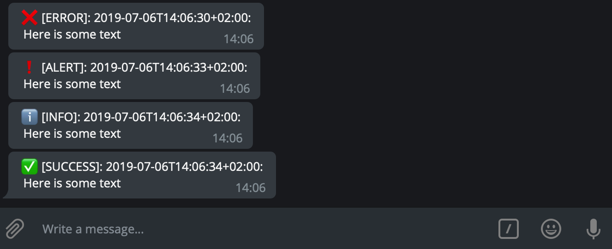

# Telelog - Log via Telegram

Sends your log to your Telegram account. Uses the Telegram Bot API.

## Setup

- Create a Bot (and get its token), see https://core.telegram.org/bots
- Start chatting with the bot (and actually send something - needed for the next step)
- To get the `CHAT_ID` send the following request:
`curl https://api.telegram.org/bot<TOKEN>/getUpdates`

## Usage

```go
logger := telelog.NewTelelog("TOKEN", "CHAT_ID") // os.Getenv("TOKEN")
logger.LogError("Here is some text")
logger.LogAlert("Here is some text")
logger.LogInfo("Here is some text")
logger.LogSuccess("Here is some text")
```


